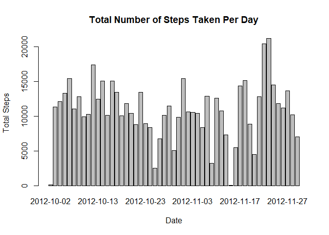
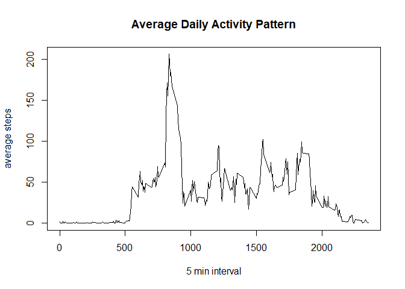
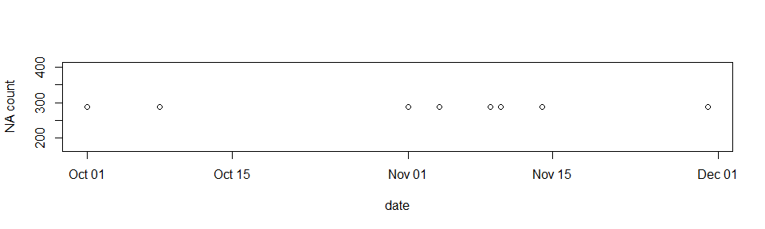
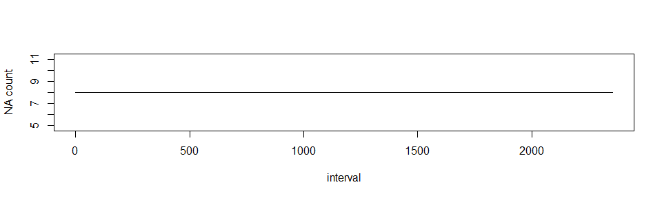
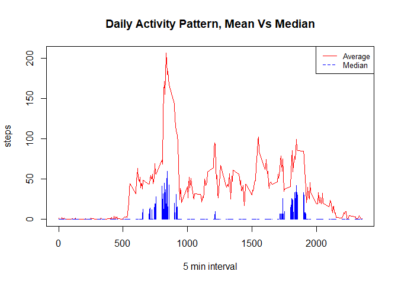
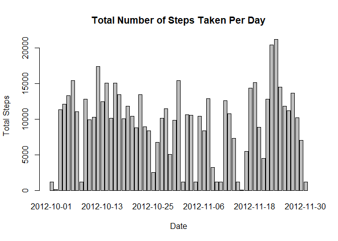
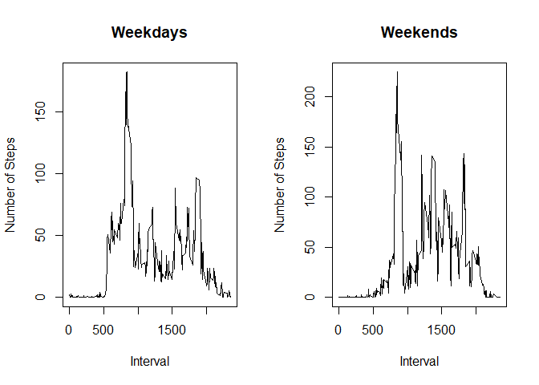

## Loading and preprocessing the data

```r
unzip ("activity.zip", exdir="./data")
df <- read.csv("./data/activity.csv")
unlink("./data", recursive=TRUE)
```
Now the data is loaded into variable df, let's preprocess the data

```r
# Change date into date type
library(lubridate)
df$date <- ymd(df$date)
```

## What is mean total number of steps taken per day?

```r
library(dplyr)
# Ignore missing values
steps_per_day <- df %>% 
    filter(!is.na(steps)) %>%
    group_by(date) %>%
    summarise(sum=sum(steps))
```

The total number of steps taken per day is visualized through this historgram.

```r
barplot(sum ~ date, data=steps_per_day, xlab="Date", ylab="Total Steps", main="Total Number of Steps Taken Per Day")
```

<!-- -->


Report the mean and median total number of steps taken per day.

```r
report_o <- steps_per_day %>%
        summarise(mean=mean(sum), median=median(sum))
library(xtable)
xt <- xtable(report_o)
print(xt, type="html", include.rownames = FALSE)
```

<!-- html table generated in R 4.0.3 by xtable 1.8-4 package -->
<!-- Mon Sep 06 17:03:29 2021 -->
<table border=1>
<tr> <th> mean </th> <th> median </th>  </tr>
  <tr> <td align="right"> 10766.19 </td> <td align="right"> 10765 </td> </tr>
   </table>
## What is the average daily activity pattern?

Make a time series plot (i.e. \color{red}{\verb|type = "l"|}type = "l") of the 5-minute interval (x-axis) and the average number of steps taken, averaged across all days (y-axis)

```r
average_daily <- df %>%
    filter(!is.na(steps)) %>%
    group_by(interval) %>%
    summarize(average = mean(steps))
plot(x=average_daily$interval, y=average_daily$average, type="l", xlab="5 min interval", ylab="average steps", main="Average Daily Activity Pattern")
```

<!-- -->

Which 5-minute interval, on average across all the days in the dataset, contains the maximum number of steps?

```r
xt <- xtable(average_daily[which.max(average_daily$average),])
print(xt, type="html", include.rownames = FALSE)
```

<!-- html table generated in R 4.0.3 by xtable 1.8-4 package -->
<!-- Mon Sep 06 17:03:29 2021 -->
<table border=1>
<tr> <th> interval </th> <th> average </th>  </tr>
  <tr> <td align="right"> 835 </td> <td align="right"> 206.17 </td> </tr>
   </table>

## Imputing missing values

Note that there are a number of days/intervals where there are missing values (coded as \color{red}{\verb|NA|}NA). The presence of missing days may introduce bias into some calculations or summaries of the data.


Calculate and report the total number of missing values in the dataset (i.e. the total number of rows with \color{red}{\verb|NA|}NAs)

```r
na_values <- df %>% filter(is.na(steps))
print(nrow(na_values))
```

```
## [1] 2304
```


Devise a strategy for filling in all of the missing values in the dataset. The strategy does not need to be sophisticated. For example, you could use the mean/median for that day, or the mean for that 5-minute interval, etc.


Let's take a look at the distribution of these NAs.  Starting with days.

```r
na_count_day <- na_values %>% group_by(date) %>% summarise(n=n())
plot(na_count_day$date, na_count_day$n, xlab="date", ylab="NA count")
```




There are a handful of missing value dates and the missing counts look fairly consistent. Let's look at interval:

```r
na_count_time <- na_values %>% group_by(interval) %>% summarise(n=n())
plot(na_count_time$interval, na_count_time$n, xlab="interval", ylab="NA count", type="l")
```




Based on these graphs, we can conclude that there are 8 days missing values. Let's take a look a distribution of steps:


```r
steps_value <-df %>%filter(!is.na(steps))
summary(steps_value$steps)
```

```
##    Min. 1st Qu.  Median    Mean 3rd Qu.    Max. 
##    0.00    0.00    0.00   37.38   12.00  806.00
```

```r
average_daily <- df %>%
    filter(!is.na(steps)) %>%
    group_by(interval) %>%
    summarize(average = mean(steps), median = median(steps))
plot(x=average_daily$interval, y=average_daily$average, type="l", col="red",
     xlab="5 min interval", ylab="steps", main="Daily Activity Pattern, Mean Vs Median")
lines(x=average_daily$interval, y=average_daily$median, col="blue", type="h")
legend("topright", legend=c("Average", "Median"),
       col=c("red", "blue"), lty = 1:2, cex=0.8)
```

<!-- -->

The distribution of steps is highly skewed. Thus, we will be using median of each interval to impute the missing data. 


Create a new dataset that is equal to the original dataset but with the missing data filled in.

```r
impute <- df %>% 
    group_by(interval) %>% 
    mutate(steps=ifelse(is.na(steps), median(steps, na.rm=TRUE), steps))
```

Make a histogram of the total number of steps taken each day and Calculate and report the mean and median total number of steps taken per day. 


```r
i_sum <- impute %>%
    group_by(date) %>%
    summarize(sum=sum(steps))
barplot(sum ~ date, data=i_sum, xlab="Date", ylab="Total Steps", main="Total Number of Steps Taken Per Day")
```

<!-- -->

```r
# Calculate mean and median
report_i <- i_sum %>%
        summarise(mean=mean(sum), median=median(sum))
xt <- xtable(report_i)
print(xt, type="html", include.rownames = FALSE)
```

<!-- html table generated in R 4.0.3 by xtable 1.8-4 package -->
<!-- Mon Sep 06 17:03:30 2021 -->
<table border=1>
<tr> <th> mean </th> <th> median </th>  </tr>
  <tr> <td align="right"> 9503.87 </td> <td align="right"> 10395 </td> </tr>
   </table>

Do these values differ from the estimates from the first part of the assignment? What is the impact of imputing missing data on the estimates of the total daily number of steps?


Comparing 2 graphs, the general shape of distribution is similar, with 8 missing days imputed with relatively small values. Overall there's an decrease in summary statistics of daily step counts.

```r
# Calculate percentage change in mean and median of daily step counts
mean_diff = (report_i["mean"]- report_o["mean"])/report_o["mean"]
median_dff = (report_i["median"]- report_o["median"])/report_o["median"]
diff = cbind(mean_diff, median_dff)
formatted_table <- as.data.frame(matrix(
   sprintf("%.0f%%", diff*100),
   nrow(diff),
   dimnames = dimnames(diff)
))
xt <- xtable(formatted_table, label="Percentage in Change")
print(xt, type="html", include.rownames = FALSE)
```

<!-- html table generated in R 4.0.3 by xtable 1.8-4 package -->
<!-- Mon Sep 06 17:03:30 2021 -->
<table border=1>
<tr> <th> mean </th> <th> median </th>  </tr>
  <tr> <td> -12% </td> <td> -3% </td> </tr>
   <a name=Percentage in Change></a>
</table>


## Are there differences in activity patterns between weekdays and weekends?
Create a new factor variable in the dataset with two levels – “weekday” and “weekend” indicating whether a given date is a weekday or weekend day.


```r
week <- impute %>%
    mutate(day = ifelse(wday(date) <= 5, "Weekdays", "Weekends"))
```


Make a panel plot containing a time series plot (i.e. \color{red}{\verb|type = "l"|}type = "l") of the 5-minute interval (x-axis) and the average number of steps taken, averaged across all weekday days or weekend days (y-axis). 


```r
par(mfrow=c(1,2))

# Create line plot for Weekdays
weekdays <- filter(week, day=="Weekdays") %>%
  summarise(mean=mean(steps))
plot(x=weekdays$interval, y=weekdays$mean, type="l", xlab="Interval", ylab="Number of Steps", main="Weekdays")
# Create line plot for Weekends
weekends <- filter(week, day=="Weekends") %>% 
  summarise(mean=mean(steps))
plot(x=weekends$interval, y=weekends$mean, type="l", xlab="Interval", ylab="Number of Steps", main="Weekends")
```

<!-- -->

Looking at average activity durign the intervals, even though weekdays and weekends show very similar pattern, the local maximum on the weekends are much higher than that of the weekdays. 
